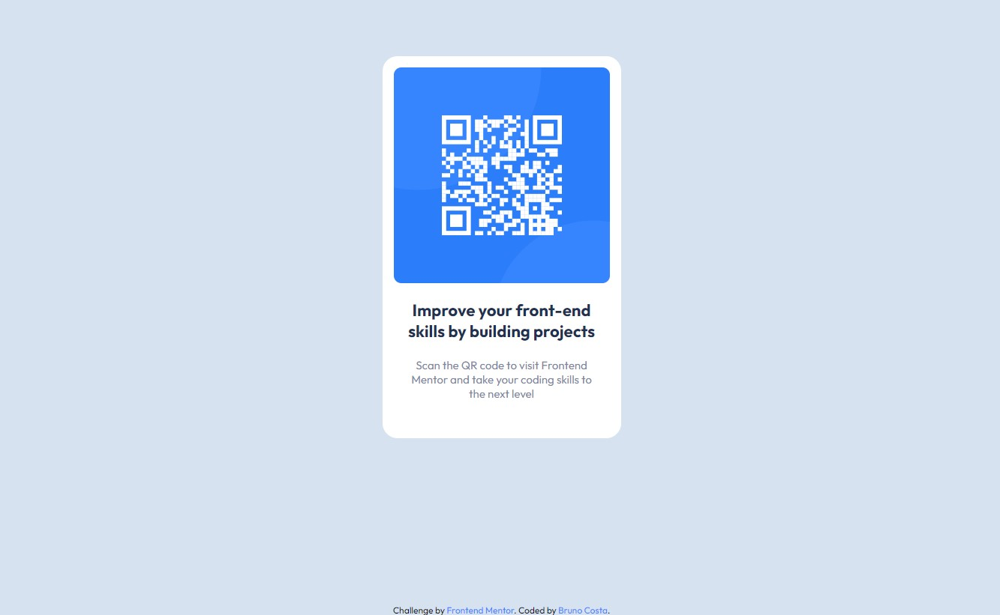

# Frontend Mentor - QR code component code

This is a solution to the [QR code component challenge on Frontend Mentor](https://www.frontendmentor.io/challenges/qr-code-component-iux_sIO_H). 

## Table of contents

- [Overview](#overview)
  - [Screenshot](#screenshot)
  - [Links](#links)
- [My process](#my-process)
  - [Built with](#built-with)
  - [What I learned](#what-i-learned)
  - [Useful resources](#useful-resources)
- [Author](#author)

**Note: Delete this note and update the table of contents based on what sections you keep.**

## Overview

### Screenshot



### Links

- [Solution URL](https://www.frontendmentor.io/solutions/qr-code-challenge-using-html-and-css-2QrRY7ThuE)
- [Site URL](https://brncosta.github.io/qr-code-challenge/)

## My process

### Built with

- HTML5
- CSS
- Flexbox

### What I learned

Using css variables:

```css
:root {
    --white: hsl(0, 0%, 100%);
    --lightGray: hsl(212, 45%, 89%);
    --grayishBlue: hsl(220, 15%, 55%);
    --darkBlue: hsl(218, 44%, 22%);
}

.info-text p {
    color: var(--darkBlue);
}
```

### Useful resources

- [CSS Complete Guide to Flexbox](https://css-tricks.com/snippets/css/a-guide-to-flexbox/) - This website always help me when I'm using flexbox.

## Author

- LinkedIn - [Bruno Costa](https://www.linkedin.com/in/bcosta98/)
- Frontend Mentor - [@BrnCosta](https://www.frontendmentor.io/profile/BrnCosta)
- Twitter - [@_brnCosta](https://www.twitter.com/_brnCosta)